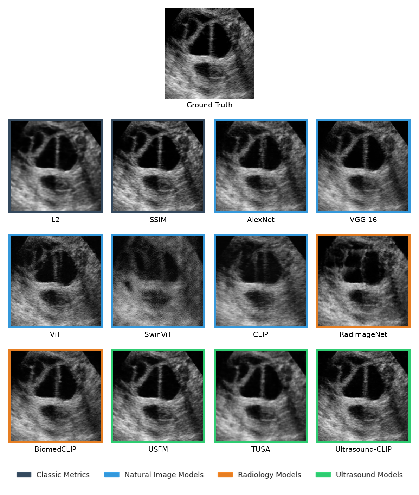

# UltraPIPS: Perceptual Similarity for B-mode Ultrasound
[](https://arxiv.org/abs/2608.26033)
[](#citation)
[](LICENSE)

**UltraPIPS** is a library of LPIPS-style perceptual metrics for B-mode ultrasound. Its backbones are open-source ultrasound foundation models, not networks pretrained on natural images.

B-mode images have speckle patterns and acoustic statistics unlike those of natural images or other radiology modalities. We compared LPIPS backbones from three groups: natural image, radiology and ultrasound. Each was tested on classification, segmentation and reconstruction.

- **Correlation with downstream performance:** ultrasound backbones tracked the performance of supervised downstream models more closely than classical metrics and natural-image models.
- **Reconstruction:** as an LPIPS loss, they gave the best balance between reconstruction quality and realistic speckle texture.
- **No anatomic distortion:** they were the only backbones tested that did not distort anatomic details on visual inspection.


<sub>Implicit neural representations of a USOVA follicle volume, each trained with L2 plus a different perceptual loss. Natural-image and radiology backbones invent fine detail or bend tissue. Ultrasound backbones keep the anatomy and recover realistic speckle.</sub>

## Installation

We recommend using `uv`.

```bash
uv add git+https://github.com/talg2324/UltraPIPS.git
```

## Usage

```python
import torch
from ultrapips import UltraPIPS

# Default backbone: TUSA (weights are bundled with the tusa package)
loss_fn = UltraPIPS(backbone="tusa_vit")

# Inputs: (B, C, H, W), float32 in [0, 1] or uint8. 1- or 3-channel.
x = torch.rand(4, 1, 128, 128)
y = torch.rand(4, 1, 128, 128)

d = loss_fn(x, y)  # scalar with reduction="mean"; use reduction="none" for per-sample values
```

Resizing, channel conversion and normalization for each backbone are handled internally.

### Backbones and weights

| `backbone`        | Domain     | Weights                                                                                                                    |
|-------------------|------------|----------------------------------------------------------------------------------------------------------------------------|
| `tusa_vit`        | Ultrasound | Bundled with [talg2324/tusa](https://github.com/talg2324/tusa) — no download needed                                        |
| `usfm`            | Ultrasound | Download from [openmedlab/USFM](https://github.com/openmedlab/USFM), pass as `model_path`                                  |
| `ultrasound_clip` | Ultrasound | Download from [ZJUDataIntelligence/Ultrasound-CLIP](https://github.com/ZJUDataIntelligence/Ultrasound-CLIP), pass as `model_path` |
| `biomedclip`      | Radiology  | Auto-downloaded from [Hugging Face](https://huggingface.co/microsoft/BiomedCLIP-PubMedBERT_256-vit_base_patch16_224)        |
| `medsam`          | Radiology  | Download `medsam_vit_b.pth` from [bowang-lab/MedSAM](https://github.com/bowang-lab/MedSAM), pass as `model_path`            |
| `clip`            | Natural    | Auto-downloaded (OpenAI ViT-B/16 via `open_clip`)                                                                          |
| `vit_imagenet`    | Natural    | Auto-downloaded (torchvision)                                                                                              |
| `swin_imagenet`   | Natural    | Auto-downloaded (torchvision)                                                                                              |

```python
loss_fn = UltraPIPS(backbone="usfm", model_path="weights/USFM.pt")
```

The AlexNet, VGG-16 and RadImageNet baselines in the paper come from the original [`lpips`](https://github.com/richzhang/PerceptualSimilarity) package and [MONAI](https://docs.monai.io/en/stable/losses.html#perceptualloss). They are not wrapped here.

### Reproducing the paper

The code for the classification (EchoPrime), segmentation (UltraSam) and INR experiments is in [experiments/](experiments/).

## Citation

If you use UltraPIPS in your research, please cite our paper:

```bibtex
@inproceedings{Grutman2026UltraPIPS,
  title={UltraPIPS: Improving model perception in B-mode ultrasound with foundation models},
  author={Grutman, Tal and Ilovitsh, Tali},
  booktitle={MICCAI Workshop on Advances in Simplifying Medical Ultrasound (ASMUS)},
  year={2026},
  eprint={2608.26033},
  archivePrefix={arXiv}
}
```
